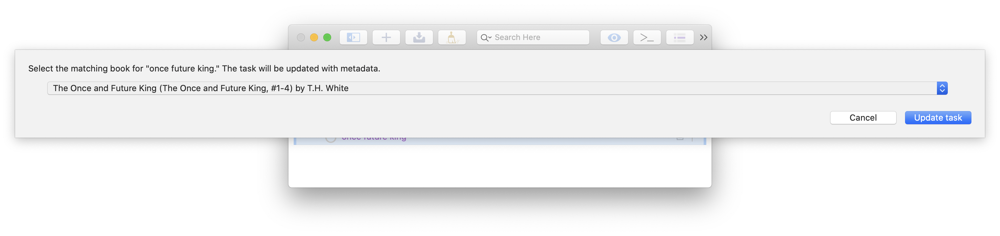

# OmniFocus Automation Plugins

Personal repository of [Automation](https://omni-automation.com) plug-ins for [OmniFocus](https://www.omnigroup.com/omnifocus/).

## parent\_of\_last\_completed\_action.omnijs
After completing a task, run this action to navigate to the parent project or remaining parent task group in the Projects perspective.

## Complete\_and\_create\_next\_action.omnijs
Mark a task complete and display a form for creating a follow-up action.

## Books.omnifocusjs
In progress plugin for working with a reading list of books. The lookup metadata action will search Goodreads for the task name, prompt the user to review the matches, and then update the task with book metadata. Additional sources such as your local library can be checked and the task annotated with a tag or keyword in the name if the library has it available.

To use, edit the lookup_metadata.js file. Add your [Goodreads API](https://www.goodreads.com/api) key on [line 4](https://github.com/cleobis/OmniFocus/blob/24175cda6fc449a2b6c4d7f878a283a3e85ace81/Books.omnifocusjs/Resources/lookup_metadata.js#L4) and edit the library and other sources on [line 67](https://github.com/cleobis/OmniFocus/blob/24175cda6fc449a2b6c4d7f878a283a3e85ace81/Books.omnifocusjs/Resources/lookup_metadata.js#L67).

Enter your books:

Select the match:

And the task is updated, including with an indication it is available at the library:

# toggle_project_status.omnifocusjs
Move projects between active, background, and on hold folders, changing status, but not moving window to new location.

# obsidian-page.omnifocusjs and notes-page.omnifocusjs
Create or open an Obsidian or Apple Notes note for the selected project.

The Apple Notes action requires my shortcut [New note with link](https://www.icloud.com/shortcuts/0794d8e83d5543d3b515e9eef0a8de47) and Scotty J's [Bubble Gum](https://heyscottyj.com/2021/05/25/sticking-stuff-together-with-bubble-gum/).
